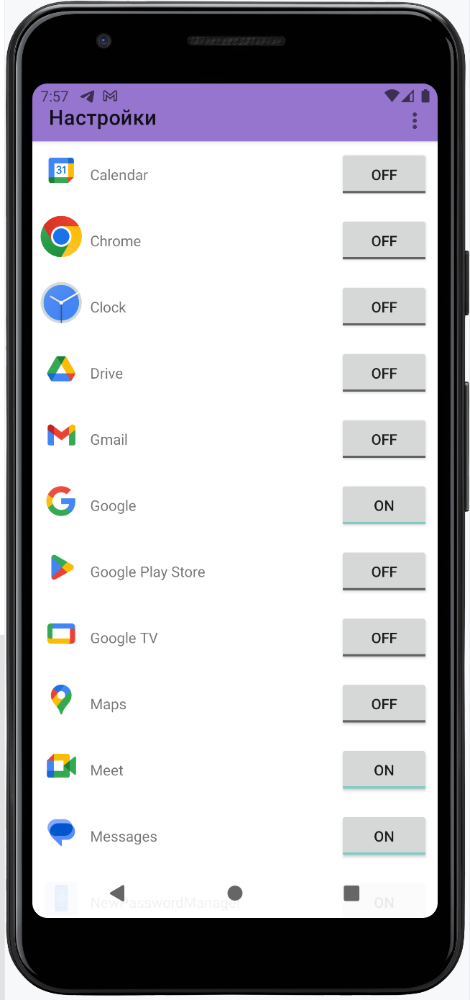

# SenderNT v.1.4.4
## Sender Notifications to Telegram
### by Wizand0

[Donate](https://pay.cloudtips.ru/p/ae98679b)

The application forwards all notifications from your phone to Telegram via a bot.  
**Note:** The Telegram Bot API token and the chat number must be specified during the application setup (coming soon).  
Additionally, you will soon be able to filter and forward notifications only from selected apps.

The application requires permissions to access the network and notifications.

## Functionality:

- Forward phone notifications to Telegram using a bot.
- Configure the bot API token and chat ID for notification sending.
- Filter notifications from specific applications.
- Enabling/disabling the service in settings;
- Localization (Ru; En)
- "Live" search in the application list
- Ability to send test notifications;

## Screenshots

The following screenshots illustrate key parts of the application:

|              Main screen              |             Settings View             |
|:-------------------------------------:|:-------------------------------------:|
|  |  |

|                 Apps                  |              Dark Theme               |
|:-------------------------------------:|:-------------------------------------:|
|  |  |

## TODO
- ~~Improve the UI/UX and add additional features.~~
- ~~Beautiful and user-friendly UI;~~
- ~~Sending a test notification;~~
- ~~Add "live" search in the application list as characters are entered.~~
- ~~Improve the user interface and add new features;~~
- ~~Add the ability to send test notifications;~~
- ~~Add "live" search in the application list as characters are typed;~~
- Customize the format of information sent to the chat (reorder fields and select required fields):
    - Device;
    - Package;
    - Application name;
    - Date;
    - Time;
    - Title;
    - Text;
    - Other fields.

## Very long-term TODO
- Integrate with cloud storage for backup settings.
- Add advanced notification analytics.

## Skills
- Kotlin
- SharedPreferences
- Kotlin Coroutines for asynchronous operations.

## Versions
- v1.4.4: Redesign
- v1.4.3: Material design for apps activity
- v1.4.2: Optimizing and some fixes, locales: fr, it, pl, es, zn, de, it, ko, uz
- v1.4.1: Fixed application crashes on screen rotation
- v1.4.0: Monetization
- v1.3.8: EditText material design (Settings activity), test notifications
- v1.3.7: Implement Microsoft Clarity
- v1.3.6: View fixes, ProGuard, LiveSearch for system apps 
- v1.3.5: Live search apps
- v1.3.3: Dark Theme fixing; fixing mistakes in texts
- v1.3.2: Bugs fixing
- v1.3: Fixing apps activity; dark theme; buttons for bots links
- v1.2: Help windows, some fixes
- v1.1.5: Some fixes. Starting implement material design
- v1.1: Enabling/disabling the service in settings;
- v0.5: Basic functionality;
- v0.1: Initial version (beta)

## Useful resources
- [Kotlin Documentation](https://kotlinlang.org/docs/reference/)
- [OkHttp Library](https://square.github.io/okhttp/)
- [Telegram Bot API](https://core.telegram.org/bots/api)

---

# SenderNT
## Отправка уведомлений на Telegram
### от Wizand0

Это приложение пересылает все уведомления с вашего телефона в Telegram через бота.  
**Примечание:** API токен бота и номер чата необходимо указывать в настройках приложения.  
Также, есть возможность пересылать уведомления только от выбранных приложений.

Приложению требуются разрешения на доступ к сети и уведомлениям.

## Функциональность:

- Пересылка уведомлений с телефона в Telegram через бота.
- Настройка API токена бота и ID чата для отправки уведомлений.
- Фильтрация уведомлений по конкретным приложениям.
- Включение/выключение службы в настройках;
- Локализация на русский и английский языки;

## Скриншоты

Ниже представлены скриншоты, демонстрирующие ключевые экраны приложения:

|             Главный экран             |            Экран настроек             |
|:-------------------------------------:|:-------------------------------------:|
|  |  |

|           Список приложений           |              Темная тема              |
|:-------------------------------------:|:-------------------------------------:|
|  |  |

## TODO
- Улучшить пользовательский интерфейс и добавить новые функции;
- Красивое  и удобное UI;
- Отправка тестового уведомления;
- Добавить "живой" поиск в списке приложений по мере ввода символов;
- Кастомизировать вывод информации в чат (порядок пунктов и выбор необходимых пунктов):
    - Устройство;
    - Пакет;
    - Название приложения;
    - Дата;
    - Время;
    - Заголовок;
    - Текст;
    - Другие пункты

## Долгосрочные TODO
- Интегрировать облачное хранилище для резервного копирования настроек.
- Добавить расширенную аналитику уведомлений.

## Полезные ресурсы
- [Документация по Kotlin](https://kotlinlang.org/docs/reference/)
- [Библиотека OkHttp](https://square.github.io/okhttp/)
- [Telegram Bot API](https://core.telegram.org/bots/api)

