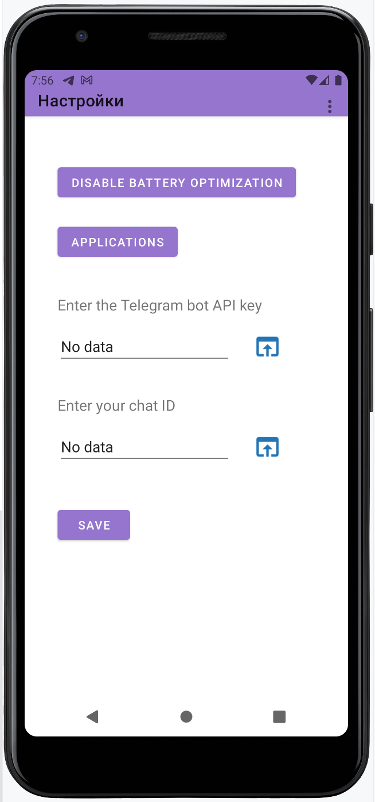

# SenderNT v.1.3.2
## Sender Notifications to Telegram
### by Wizand0

[Donate](https://pay.cloudtips.ru/p/ae98679b)

The application forwards all notifications from your phone to Telegram via a bot.  
**Note:** The Telegram Bot API token and the chat number must be specified during the application setup (coming soon).  
Additionally, you will soon be able to filter and forward notifications only from selected apps.

The application requires permissions to access the network and notifications.

## Functionality:

- Forward phone notifications to Telegram using a bot.
- Configure the bot API token and chat ID for notification sending.
- Filter notifications from specific applications.
- Enabling/disabling the service in settings;
- Localization (Ru; En)

## Screenshots

The following screenshots illustrate key parts of the application:

|              Main screen              |             Settings View             |
|:-------------------------------------:|:-------------------------------------:|
|  |  |

|                 Apps                  |         Notifications access          |
|:-------------------------------------:|:-------------------------------------:|
|  |  |

## TODO
- ~~Enabling/disabling the service in settings;~~
- ~~Implement the bot API token and chat configuration.~~
- ~~Develop filtering for app-specific notifications.~~
- Improve the UI/UX and add additional features.
- Beautiful and user-friendly UI;
- ~~Localization (Ru; En)~~
- Beautiful and user-friendly UI;
- Sending a test notification;
- ~~Fix periodic malfunctioning of toggles in the applications activity;~~
- ~~Fix buttons for navigating to Telegram bots (to get the ID);~~
- ~~Fix the display of the dark theme;~~
- Add "live" search in the application list as characters are entered.
- Add author's contacts
  Implement bot API token and chat ID configuration;

- ~~Develop notification filtering by applications;~~
- Improve the user interface and add new features;
- ~~Enable/disable the service in the settings;~~
- Create a beautiful and user-friendly UI;
- Add the ability to send test notifications;
- ~~Fix occasional failures of toggles in application activity;~~
- ~~Fix buttons for navigating to Telegram bots (to retrieve IDs);~~
- ~~Fix the display of the dark theme;~~
- ~~Fix the Applications Window (RecyclerView);~~
- ~~Fix the settings screen;~~
- ~~Add a main menu to all screens;~~
- ~~Add an additional screen with all applications, including system ones;~~
- Add "live" search in the application list as characters are typed;
- ~~Add a menu or buttons for contacting the author (feedback) and a link to GitHub;~~
- Customize the format of information sent to the chat (reorder fields and select required fields):
  - Device;
  - Package;
  - Application name;
  - Date;
  - Time;
  - Title;
  - Text;
  - Other fields.

## Very long-term TODO
- Integrate with cloud storage for backup settings.
- Add advanced notification analytics.

## Skills
- Kotlin
- SharedPreferences
- Kotlin Coroutines for asynchronous operations.

## Versions
- v1.3.2: Bugs fixing
- v1.3: Fixing apps activity; dark theme; buttons for bots links
- v1.2: Help windows, some fixes
- v1.1.5: Some fixes. Starting implement material design
- v1.1: Enabling/disabling the service in settings;
- v0.5: Basic functionality;
- v0.1: Initial version (beta)

## Useful resources
- [Kotlin Documentation](https://kotlinlang.org/docs/reference/)
- [OkHttp Library](https://square.github.io/okhttp/)
- [Telegram Bot API](https://core.telegram.org/bots/api)

---

# SenderNT
## Отправка уведомлений на Telegram
### от Wizand0

Это приложение пересылает все уведомления с вашего телефона в Telegram через бота.  
**Примечание:** API токен бота и номер чата необходимо указывать в настройках приложения.  
Также, есть возможность пересылать уведомления только от выбранных приложений.

Приложению требуются разрешения на доступ к сети и уведомлениям.

## Функциональность:

- Пересылка уведомлений с телефона в Telegram через бота.
- Настройка API токена бота и ID чата для отправки уведомлений.
- Фильтрация уведомлений по конкретным приложениям.
- Включение/выключение службы в настройках;
- Локализация на русский и английский языки;

## Скриншоты

Ниже представлены скриншоты, демонстрирующие ключевые экраны приложения:

|             Главный экран             |            Экран настроек             |
|:-------------------------------------:|:-------------------------------------:|
|  |  |

|           Список приложений           |         Доступ к уведомлениям         |
|:-------------------------------------:|:-------------------------------------:|
|  |  |

## TODO
- ~~Реализовать настройку API токена бота и номера чата;~~
- ~~Разработать фильтрацию уведомлений по приложениям;~~
- Улучшить пользовательский интерфейс и добавить новые функции;
- ~~Включение/выключение службы в настройках;~~
- Красивое  и удобное UI;
- Отправка тестового уведомления;
- ~~Исправить периодическое несрабатывание переключателей в активности приложений;~~
- ~~Исправить кнопки для перехода в телеграм боты (для получения ID);~~
- ~~Исправить отображение темной темы;~~
- ~~Исправить Окно приложений (RecyclerView);~~
- ~~Исправить экран настроек;~~
- ~~Добавить главное меню во всех экранах;~~
- ~~Добавить дополнительный экран со всеми приложениями, включая системные;~~
- Добавить "живой" поиск в списке приложений по мере ввода символов;
- ~~Добавить меню или кнопки для связи с автором (обратная связь) и ссылку на github;~~
- Кастомизировать вывод информации в чат (порядок пунктов и выбор необходимых пунктов):
  - Устройство;
  - Пакет;
  - Название приложения;
  - Дата;
  - Время;
  - Заголовок;
  - Текст;
  - Другие пункты

## Долгосрочные TODO
- Интегрировать облачное хранилище для резервного копирования настроек.
- Добавить расширенную аналитику уведомлений.

## Полезные ресурсы
- [Документация по Kotlin](https://kotlinlang.org/docs/reference/)
- [Библиотека OkHttp](https://square.github.io/okhttp/)
- [Telegram Bot API](https://core.telegram.org/bots/api)

