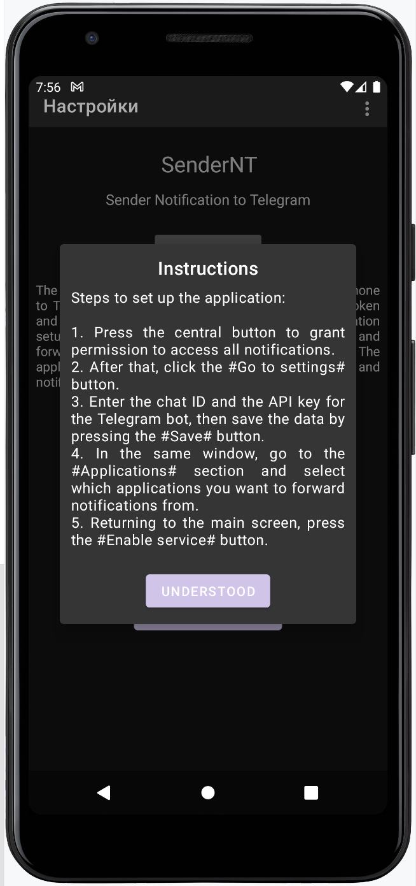

# SenderNT
## Sender Notifications to Telegram
### by Wizand0

The application forwards all notifications from your phone to Telegram via a bot.  
**Note:** The Telegram Bot API token and the chat number must be specified during the application setup (coming soon).  
Additionally, you will soon be able to filter and forward notifications only from selected apps.

The application requires permissions to access the network and notifications.

## Functionality:

- Forward phone notifications to Telegram using a bot.
- Configure the bot API token and chat ID for notification sending.
- Filter notifications from specific applications.
- Enabling/disabling the service in settings;
- Localization (Ru; En)

## Screenshots

The following screenshots illustrate key parts of the application:

|          Main screen           |           Main View            |
|:------------------------------:|:------------------------------:|
|  |  |

|         Searching bar          |             Export             |
|:------------------------------:|:------------------------------:|
|  |  |

## TODO
- ~~Enabling/disabling the service in settings;~~
- ~~Implement the bot API token and chat configuration.~~
- ~~Develop filtering for app-specific notifications.~~
- Improve the UI/UX and add additional features.
- Beautiful and user-friendly UI;
- ~~Localization (Ru; En)~~

## Very long-term TODO
- Integrate with cloud storage for backup settings.
- Add advanced notification analytics.

## Skills
- Kotlin
- SharedPreferences
- Kotlin Coroutines for asynchronous operations.

## Versions
- v1.1: Enabling/disabling the service in settings;
- v0.5: Basic functionality;
- v0.1: Initial version (beta)

## Useful resources
- [Kotlin Documentation](https://kotlinlang.org/docs/reference/)
- [OkHttp Library](https://square.github.io/okhttp/)
- [Telegram Bot API](https://core.telegram.org/bots/api)

---

# SenderNT
## Отправка уведомлений на Telegram
### от Wizand0

Это приложение пересылает все уведомления с вашего телефона в Telegram через бота.  
**Примечание:** API токен бота и номер чата необходимо указывать в настройках приложения (скоро будет).  
Также в скором времени появится возможность пересылать уведомления только от выбранных приложений.

Приложению требуются разрешения на доступ к сети и уведомлениям.

## Функциональность:

- Пересылка уведомлений с телефона в Telegram через бота.
- Настройка API токена бота и ID чата для отправки уведомлений.
- Фильтрация уведомлений по конкретным приложениям.
- Включение/выключение службы в настройках;
- Локализация на русский и английский языки;

## Скриншоты

Ниже представлены скриншоты, демонстрирующие ключевые экраны приложения:

|          Экран входа           |           Основное окно         |
|:------------------------------:|:------------------------------:|
|  |  |

|         Панель поиска          |             Экспорт            |
|:------------------------------:|:------------------------------:|
|  |  |

## TODO
- ~~Реализовать настройку API токена бота и номера чата.~~
- ~~Разработать фильтрацию уведомлений по приложениям.~~
- Улучшить пользовательский интерфейс и добавить новые функции.
- ~~Включение/выключение службы в настройках;~~
- Красивое  и удобное UI;

## Долгосрочные TODO
- Интегрировать облачное хранилище для резервного копирования настроек.
- Добавить расширенную аналитику уведомлений.

## Используемые технологии
- Kotlin
- SharedPreferences
- Kotlin Coroutines для асинхронных операций.

## Версии
- v1.1: Включение/выключение службы в настройках;
- v0.5: Базовая функциональность
- v0.1: Первая версия (бета)

## Полезные ресурсы
- [Документация по Kotlin](https://kotlinlang.org/docs/reference/)
- [Библиотека OkHttp](https://square.github.io/okhttp/)
- [Telegram Bot API](https://core.telegram.org/bots/api)
